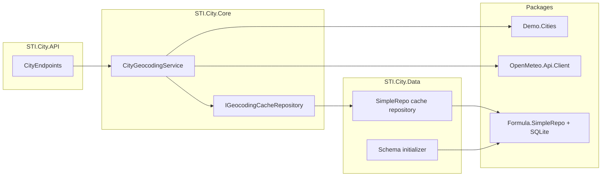
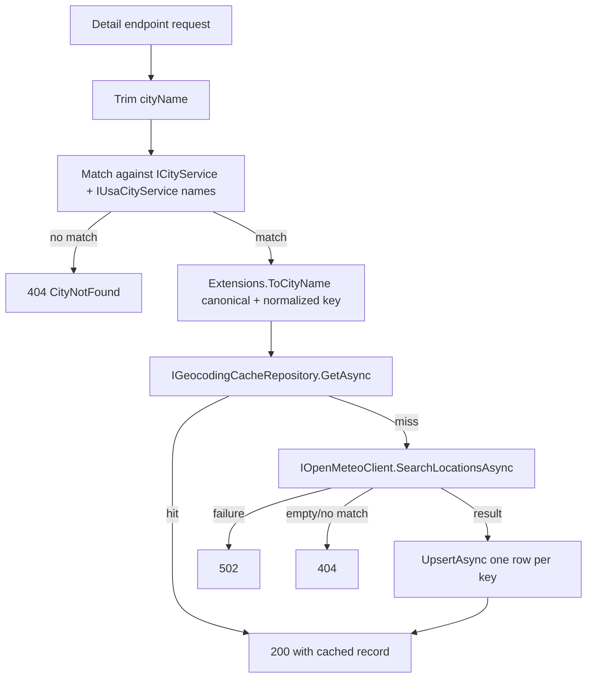

# City API implementation plan (BRD → `cursor/`)

## Goal

Build a fresh **City** Minimal API in [`cursor/`](cursor/) that satisfies [design/brd.md](design/brd.md):

- Four JSON endpoints with documented status codes (`200`, `404`, `502`, `500`)
- QA `Demo.Cities` + `OpenMeteo.Api.Client` via DI extensions
- SQLite cache-aside via **verified** `Formula.SimpleRepo` APIs
- Shared cached geocoding record for `/location` and `/population`
- Full automated test coverage per BRD acceptance criteria

Reference implementations in [`claude/`](claude/) and [`codex/`](codex/) are useful for patterns only; do not copy wholesale—resolve APIs through DevContext and follow company skills.

## Prerequisites (before Stage 0)

1. **DevContext MCP** running at `http://127.0.0.1:2222/mcp` (see [.mcp.json](.mcp.json)).
2. **NuGet demo feeds** from [dev-context-mcp-server](https://github.com/iJustHelp/dev-context-mcp-server) for QA `Demo.Cities` and prod `OpenMeteo.Api.Client`.
3. **.NET 10 SDK**.
4. Add [`cursor/nuget.config`](cursor/nuget.config) pointing to nuget.org + demo feeds (avoid machine-specific paths like [`claude/nuget.config`](claude/nuget.config) unless your demo machine uses the same layout).

## Agent workflow (every stage)

Follow [AGENTS.md](AGENTS.md) and the [`dev-context`](.agents/skills/dev-context/SKILL.md) skill:

1. `resolve_library` → `list_versions` → `query_docs` / `get_symbol`
2. Apply [`api-architecture`](.agents/skills/api-architecture/SKILL.md), [`csharp-naming`](.agents/skills/csharp-naming/SKILL.md), and [`unit-test-generation`](.agents/skills/unit-test-generation/SKILL.md) when writing code/tests
3. If DevContext returns `not_found`, `insufficient_evidence`, or `not_ready`: **stop** and document uncertainty—do not invent APIs (see Claude’s `insufficient_evidence` handling in [`claude/README.md`](claude/README.md))

## BRD requirement map

| BRD section | Implementation target |
|-------------|----------------------|
| API name `City`, STI project layout | Stage 1 — `STI.City.{API,Core,Data,Tests}` per api-architecture skill |
| `GET /city`, `GET /city/usa` | Stage 4 — preserve package list order |
| `GET /city/{cityName}/location`, `/population` | Stages 3–4 — one `ICityGeocodingService` path |
| Case-insensitive + URL-decoded names | Stage 3 — route binding + trim; merge both city sources |
| `404` unknown city / no Open-Meteo match | Stage 3–4 |
| `502` Open-Meteo failure, no cache | Stage 3–4 |
| Cache-aside, one row per normalized name | Stages 2–3 |
| `Formula.SimpleRepo` for SQLite | Stage 2 — only after DevContext verification |
| QA `Demo.Cities` | Stage 1 — package reference + `AddDemoCities()` |
| Acceptance criteria (lists, cache sharing, no repeat upstream, tests) | Stages 3–5 |

## Architecture



## Cache-aside flow (Stage 3)



**City resolution rule (BRD + stage-6 prompts):** merge `ICityService.GetCityNames()` and `IUsaCityService.GetCityNames()` when resolving detail routes so U.S.-only cities (e.g. Seattle) are valid. Use `Demo.Cities.Extensions.ToCityName()` for canonical display, upstream query, and cache key (verify via DevContext in Stage 0).

---

## Stage 0 — Resolve architecture and package APIs

**Deliverables:** short resolution notes (in commit message or `cursor/README.md` section) with DevContext `citationUri` values.

Query DevContext for:

| Topic | Expected evidence |
|-------|-------------------|
| Project layout | `docs:company-docs/api.architecture.md` |
| Unit test template | `docs:company-docs/test-template.instructions.md` |
| `Demo.Cities` QA version | `ICityService`, **QA-only** `IUsaCityService`, `Extensions.ToCityName`, `AddDemoCities()` |
| `OpenMeteo.Api.Client` | `IOpenMeteoClient.SearchLocationsAsync`, `GeocodingResponse`, `LocationResult`, `ApiException`, `AddOpenMeteoApiClient` |
| `Formula.SimpleRepo` | `RepositoryBase`, entity registration, SQLite connection config, upsert/get patterns |

**Exit:** package versions chosen; every public API used in later stages has a citation; any `insufficient_evidence` gap is explicitly documented with a fallback decision.

---

## Stage 1 — Scaffold the City solution

Create [`cursor/City.slnx`](cursor/City.slnx) with four projects:

| Project | References | Key packages |
|---------|------------|--------------|
| `STI.City.API` | Core, Data | Serilog (per company docs) |
| `STI.City.Core` | — | `Demo.Cities` (QA), `OpenMeteo.Api.Client` |
| `STI.City.Data` | Core | `Formula.SimpleRepo`, SQLite driver |
| `STI.City.Tests` | API, Core, Data | xUnit, Moq, `Microsoft.AspNetCore.Mvc.Testing` |

**Work:**

- `Directory.Build.props` — `net10.0`, nullable, implicit usings
- `ConnectionStrings:CityCache` required at startup (fail fast if missing)
- Register `AddDemoCities()`, Open-Meteo client, Core/Data DI extensions
- Serilog + global exception handler stub
- Empty `/city` route group
- `InternalsVisibleTo` on API for `WebApplicationFactory`
- Startup smoke test (config validation)

**Exit:** `dotnet build cursor/City.slnx` succeeds.

---

## Stage 2 — SQLite cache (`Formula.SimpleRepo`)

**Core contracts** in `STI.City.Core`:

```csharp
// GeocodingCacheRecord: normalized key, display name, country, lat, long, nullable population, RetrievedAtUtc
Task<GeocodingCacheRecord?> GetAsync(string normalizedCityName, CancellationToken ct);
Task UpsertAsync(GeocodingCacheRecord record, CancellationToken ct);
```

**Data layer:**

- `GeocodingCache` entity + schema initializer (idempotent `CREATE TABLE IF NOT EXISTS`)
- Unique constraint on normalized city name (one row per city)
- `SimpleRepoGeocodingCacheRepository` using **only verified** SimpleRepo APIs
- Register repository with lifetime required by package docs

**Tests:** isolated SQLite per test — schema idempotency, round-trip, upsert uniqueness, cache miss vs DB failure.

**Exit:** repository tests pass; no hand-written SQL outside verified patterns unless DevContext documents them.

---

## Stage 3 — City resolution and geocoding service

**`CityGeocodingService`** (scoped) with explicit outcomes:

| Outcome | HTTP mapping (Stage 4) |
|---------|------------------------|
| Success + record | 200 |
| City not in merged package lists | 404, **no** cache/Open-Meteo calls |
| Open-Meteo no matching result | 404 |
| Open-Meteo failure on cache miss | 502 |
| Missing population on otherwise valid record | 404 for `/population` only |

**Behavior:**

1. Trim input; empty → not found
2. Case-insensitive match across **merged** `ICityService` + `IUsaCityService` lists
3. `ToCityName()` → canonical name + normalized cache key
4. Cache hit → return without Open-Meteo
5. Cache miss → `SearchLocationsAsync(canonicalName, …)`; select exact name match (`OrdinalIgnoreCase`)
6. Upsert single record; same record serves location and population

**Unit tests** (Moq, company template): cache hit/miss, merged-list resolution (U.S.-only city), unknown city, empty upstream, upstream failure, shared record, cancellation token propagation, `VerifyNoOtherCalls`.

**Exit:** service unit tests pass; cache hit never invokes Open-Meteo.

---

## Stage 4 — HTTP endpoints

Map in `STI.City.API/Endpoints/CityEndpoints.cs`:

| Route | Behavior |
|-------|----------|
| `GET /city` | `ICityService.GetCityNames()` — preserve order |
| `GET /city/usa` | `IUsaCityService.GetCityNames()` — preserve order |
| `GET /city/{cityName}/location` | `{ cityName, country, latitude, longitude }` |
| `GET /city/{cityName}/population` | `{ cityName, country, population }` |

- Static `/usa` route before parameterized `{cityName}` routes
- Problem Details for errors with trace id, no leaked exception details
- OpenAPI/metadata per company convention if documented

**Exit:** endpoint-level tests with `WebApplicationFactory` + strict Moq overrides verify status codes, JSON shapes, and call counts.

---

## Stage 5 — Integration coverage (BRD acceptance criteria)

Cover every BRD acceptance scenario:

- [ ] All four endpoints return JSON + correct status codes
- [ ] List endpoints preserve alphabetical package order
- [ ] Location then population → **one** total Open-Meteo call
- [ ] Population then location → **one** total Open-Meteo call
- [ ] Pre-seeded cache bypasses Open-Meteo
- [ ] Unknown city, empty Open-Meteo, upstream failure, missing population
- [ ] Isolated SQLite per test host — no shared DB state

Target: `dotnet test cursor/City.slnx` green repeatedly.

---

## Stage 6 — Demo handoff (optional but recommended)

- [`cursor/README.md`](cursor/README.md) — endpoints, config, DevContext citations, `dotnet test` / `dotnet run` (port `3333` to align with [`http-tests/http-client.env.json`](http-tests/http-client.env.json))
- Add `codex` / `cursor` environment to root [`http-tests/http-client.env.json`](http-tests/http-client.env.json) if live smoke tests should target the new build
- Update root [`README.md`](README.md) to list `cursor/` alongside `claude/` and `codex/`

---

## Verification commands

```bash
dotnet test cursor/City.slnx
dotnet run --project cursor/STI.City.API
# REST Client: http-tests/ against local env (http://localhost:3333)
```

## Risk register

| Risk | Mitigation |
|------|------------|
| `Formula.SimpleRepo` `insufficient_evidence` | Stop per AGENTS.md; document gap; do not invent `Repo<>` APIs |
| NuGet feeds missing on clone | `cursor/nuget.config` + README prerequisite |
| BRD vs stage-3 plan (only `ICityService`) | Follow merged-list + `ToCityName` behavior (codex pattern in [`codex/STI.City.Core/Services/CityGeocodingService.cs`](codex/STI.City.Core/Services/CityGeocodingService.cs)) |
| `NU1903` SQLite advisory | Transitive warning; document if present (same as claude build) |
